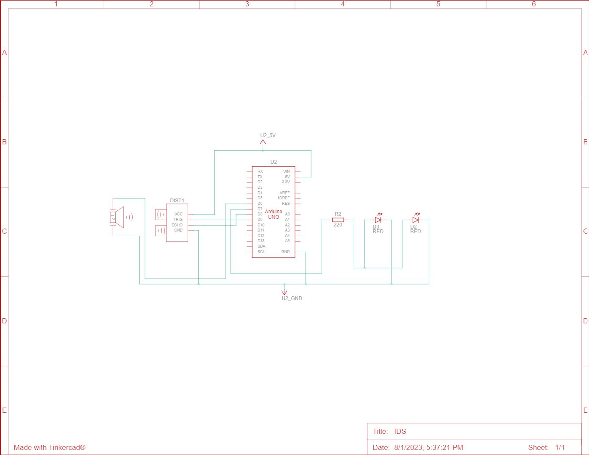

# Intrusion-Detection-System

#### *"Security is my Passion!" - LivingJW30*
Hence the reasoning behind this project. Everyone wants their privacy. May it be from a nosy sibling or a pesky burgalar. This Intrusion Detection System (IDS) was made to counter just this. If someone is where they shouldn't be the IDS will make sure you know. Though a simple design at heart, it is no doubt effective. Let's not forget its low price compared to your average commercial security system. Plus you get to say you made it yourself!

## The Process
This project is a simple introduction to embedded systems and the basics of circuitry. I truly enjoyed mixing software with hardware to make a system to help with daily life. I was also able to implement some of the things I have learned in C to Arduinos C++ like language. Items used in the building of this circuit was an Arduino (in this case I used an ELEGOO Uno), breadboard, male-to-male wires, LEDs, 220 Ohm resistor, buzzer, and a ultrasonic sensor.

## Schematics
1. 

## Resources
+ [TINKERCAD](https://www.tinkercad.com/dashboard?type=circuits&collection=designs) was used for protoyping.
+ [Arduino Get Started](https://arduinogetstarted.com/) was used for documentation.

[def]: C:\Users\Livin\OneDrive\Pictures\Screenshots